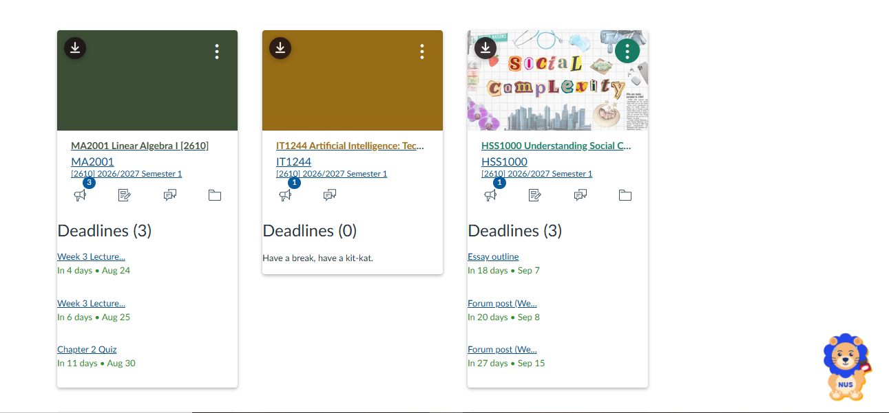
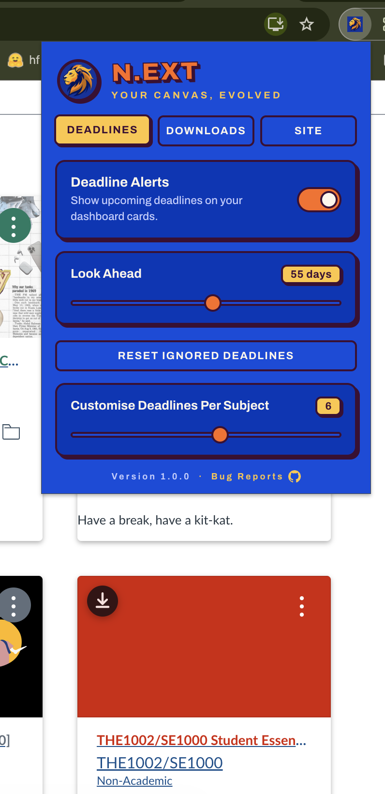

# N.ext

A Chrome extension that makes Canvas better for NUS students. It includes deadlines on your dashboard cards, one-click course file downloads, and an NUS-themed skin. Comes with a companion CLI for anyone who'd rather live in the terminal.



---

## ⚠️ Use the new dashboard view

N.ext injects into Canvas's **Card View** dashboard. If your dashboard is set to List View or Recent Activity, nothing will appear.

To switch: open your Canvas dashboard → click the **⋮** menu in the top-right → select **Card View**.

---

## Features

### Deadlines on your course cards

Every dashboard card gets a list of upcoming assignments and quizzes, sorted by urgency, with a colour-coded countdown: red when it's overdue, amber when it's close, green when you've got time. Only uncompleted work shows up; anything you've already submitted disappears on its own. 

<p align="center">
  
</p>

Two settings in the popup control what you see:

| Setting | What it does | Range |
| --- | --- | --- |
| **Look Ahead** | How far into the future to pull deadlines | 5–100 days |
| **Deadlines Per Subject** | Max rows shown on any one card | 1–10 |

### Dismiss deadlines you don't care about

Some assignments don't count toward your grade and you're never going to do them. Hover a deadline row and hit the **×** to ignore it. It disappears from the card and stops affecting anything downstream.

Changed your mind? **Reset ignored deadlines** in the popup's Deadlines tab clears the whole list.

### Download an entire course's files

Each card gets a download button in its header. One click grabs every file from that course's Files section and drops it in your Downloads folder, with filenames sanitised so Windows doesn't choke on them.

### LiNUS, a Canvas pet

A small lion sits in the corner of your dashboard and reacts to your workload; relaxed with a Kit Kat when you're clear, jittery when you're buried, and openly crying when something's overdue.


### NUS theme

Recolours Canvas in NUS blue and orange: navy gradient header, orange primary buttons, hard-shadowed dashboard cards, and a ten-course palette so your modules stay visually distinct. Toggle it off in the **Site** tab to get plain Canvas back.

---

## Install

1. Download the latest `n.ext-vX.X.X.zip` from [Releases](https://github.com/allosaurus04/N.ext/releases) and unzip it or clone the repo and use the `extension/` folder directly.
2. Go to `chrome://extensions`.
3. Turn on **Developer mode** (top-right).
4. Click **Load unpacked** and select the unzipped folder.
5. Open [canvas.nus.edu.sg](https://canvas.nus.edu.sg) and reload the tab.

> If you reload the extension after making changes, reload the Canvas tab too. Content scripts from the previous version get orphaned and silently stop working.

---

## The CLI

> **Note to Users:** The CLI is a separate feature that requires access to the Canvas API. It was built for developers who prefer interacting with Canvas from the terminal. The browser extension, however, works independently so no Canvas API setup, authentication, or programming knowledge is required. If you're interested in the CLI, see the [`next-cli/`](next-cli/) folder for setup instructions and documentation on accessing Canvas in-terminal.

```bash
next-cli deadlines        # upcoming uncompleted work
next-cli files 12345      # download every file from a course
```

---

## Project structure

```
extension/
  content/        content scripts: deadlines, downloads, LiNUS, theme
  popup/          settings UI
  background/     service worker (handles the download queue)
  assets/
next-cli/
  index.js        command dispatch
  api.js          Canvas transport + pagination
  deadlines.js    deadline fetching and filtering
  files.js        course file downloads
```

The extension and the CLI share the same logic.

---

## Privacy

N.ext has no backend. Every request goes directly from your browser (or your terminal) to `canvas.nus.edu.sg`. Your settings and ignored-deadline list live in Chrome's own storage. Nothing is collected, and nothing is sent anywhere else.

---

## Contributing

This readme was created using ChatGPT. The project is not however, so there may be bugs. 

Bug reports and feature requests welcome: [open an issue](https://github.com/allosaurus04/N.ext/issues).

If you're submitting a PR: branch off `main` with a `feature/` or `fix/` prefix, and make sure `npm run lint` passes. CI checks that `package.json` and `extension/manifest.json` versions match, so bump both together.

---

Built by an NUS student, for NUS students. Not affiliated with or endorsed by the National University of Singapore or Instructure.
